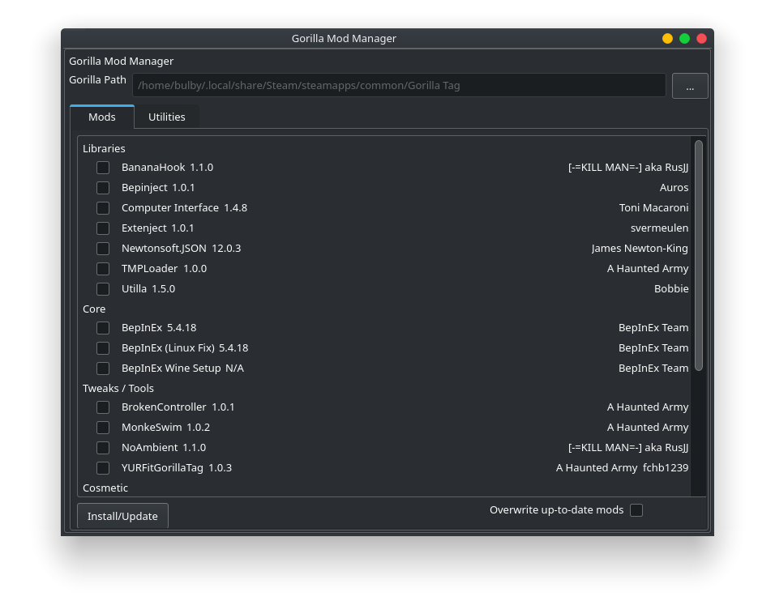
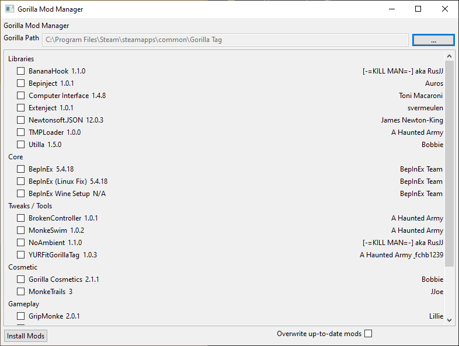

# Gorilla Mod Manager

Inspired by Monke Mod Manager, Gorilla Mod Manager is a cross platform mod manager for Gorilla Tag. It supports adding custom modinfo files with sources.xml, it fits in with your native thme, and looks plain cool :sunglasses:

